# Analyst-in-a-Box

An AI back office for a small business that runs on your own computer, with no GPU, no account and no model required.

Connect a database or drop in a spreadsheet and you can ask it questions in English or Roman Urdu and see the SQL it ran, forecast demand with totals that add up, get odd orders and refunds flagged with reasons, score customers with a points scorecard and a fairness panel, push refunds and credit-limit changes through approval gates with a tamper-evident audit trail, and watch the KPIs on a dashboard. Everything is offline; a language model is optional and never trusted.

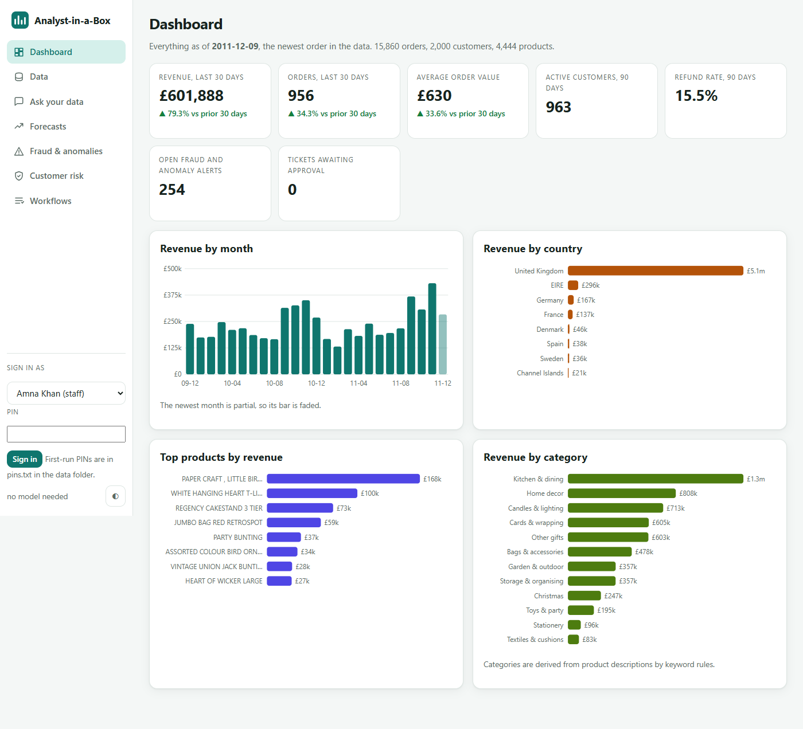

| | |
|---|---|
| **Data** | A shipped real sample (below), SQLite files, PostgreSQL URLs (optional driver), and CSV / TSV / Excel uploads (one table per sheet, types inferred). Schema browser with sample rows. An uploaded sheet of order lines can be mapped onto the business tables so every module works on it. |
| **Ask your data** | English and Roman Urdu. The SQL is always shown and editable. Read-only by construction (see below). A deterministic parser answers without a model; an LLM writes SQL when configured, and the parser answers if it fails. Result table plus a suggested chart. |
| **Forecasts** | Weekly units per product and category, hierarchical (total, category, product), reconciled so the numbers add up, Croston for intermittent demand, a rolling-origin backtest against seasonal naive for every series and method. |
| **Fraud and anomalies** | Robust z-score (median and MAD) and rule checks on orders and refunds, plus daily revenue and order-count spikes. Every alert lists its reasons with the numbers behind them. Open a review ticket or dismiss. |
| **Customer risk** | WoE/IV scorecard with points and reason codes per customer, Gini and Brier on train, validation and test, calibration, a fairness audit by country and tenure. Raise a credit-limit ticket from a customer. |
| **Workflows** | Tickets for refunds, credit-limit changes and fraud reviews. PIN sign-in, approval gates by amount, four-eyes, roles, a state machine, and a SHA-256 hash-chained audit trail with a signed head and a cross-check against the live tables. |
| **Export** | Any query result as a CSV (up to 50,000 rows) and the audit trail as a CSV. Text that starts with `=`, `+`, `-` or `@` is neutralised so a spreadsheet will not run it. |
| **Dashboard** | KPI cards with change against the previous 30 days, revenue by month, country, product and category. |

## Run it

```
uv run analyst-in-a-box        # starts the server and opens http://127.0.0.1:8780
```

or double-click `run.bat` (or the "Analyst-in-a-Box" desktop shortcut). The first run builds the sample database in about ten seconds. Options: `--port`, `--no-browser`, `--db FILE`, `--reset-pin "Name"`. Data lives in `~/.analyst-in-a-box` (set `ANALYST_HOME` to move it). Python 3.11+ and [uv](https://docs.astral.sh/uv/); everything runs on the CPU and offline.

Optional language model (never required), set before launching:

```
ANALYST_LLM=ollama     ANALYST_LLM_MODEL=qwen2.5-coder:7b          # CPU Ollama on localhost:11434
ANALYST_LLM=anthropic  ANTHROPIC_API_KEY=...                       # ANALYST_LLM_MODEL defaults to claude-haiku-4-5
ANALYST_LLM=openai     OPENAI_API_KEY=...  ANALYST_OPENAI_BASE_URL=...
```

**Signing in.** Reading, asking and exporting need no sign-in. Anything that changes state (tickets and their approvals, dismissing alerts, uploads, adding or removing a data source) needs a name and a PIN. On the first start after this version the app gives each of the four people a random 8-character PIN, stores only salted PBKDF2 hashes, and writes the PINs once to `pins.txt` in the data folder: hand each person their own line and delete the file. A lost PIN is replaced with `analyst-in-a-box --reset-pin "Bilal Ahmed"`; anyone can change their own PIN from the sidebar. Five wrong PINs lock that name for 60 seconds.

PostgreSQL needs the optional driver: `uv sync --extra postgres`.

Checks:

```
uv run pytest -q                      # 152 tests
uv run ruff check .
uv run python demo.py                 # offline end-to-end demo (output below)
uv run --with playwright python scripts/ui_tour.py http://127.0.0.1:8791 docs/screenshots PINS_FILE   # drives the real UI
```

## Input / Output

`uv run python demo.py`, no server, no model (full text in [docs/demo-output.txt](docs/demo-output.txt)):

```
Input : UCI Online Retail II, seeded sample of 2,000 customers (CC BY 4.0)
        291,897 order lines -> 15,860 orders, 2,000 customers, 4,454 products (25 MB SQLite), 2009-12-01 to 2011-12-09

Ask your data (no model)
  'Top 5 products by revenue in 2011'        [en] -> 5 rows, first ['PAPER CRAFT , LITTLE BIRDIE', 168469.6]
  'har mahine ki bikri'                      [roman-ur] -> 25 rows, first ['2009-12', 238808.69]
  'kitne customers hain'                     [roman-ur] -> 1 rows, first [1983]
  write attempt 'DELETE FROM orders' -> refused: only SELECT is permitted, got Delete

Forecast (8 weeks, mint_wls, 104 weeks of history)
  coherent before reconciling: False; after: True
  series beating seasonal naive in the backtest: 38 of 59 (4 origins)
  total     MAE seasonal naive  15,462.4 | base  10,978.5 | bottom-up  11,172.0 | mint_wls  11,141.5

Fraud and anomalies: 15,860 orders screened -> 255 alerts {'high': 24, 'medium': 81, 'low': 150}

Customer risk (refunds of 5% or more of purchases in the 240 days after 2011-04-13 ...)
  908 customers, bad rate 9.4%; Gini train 0.435 validation 0.415 test -0.194 (test: 51 customers, 2 bad)
  fairness, UK vs Other: disparate impact 0.843, four-fifths flag False
```

### The data

The sample is a seeded random sample of 2,000 customers (all of their rows, 291,897 order lines) from the UCI *Online Retail II* file: a UK online giftware wholesaler, 1 December 2009 to 9 December 2011 (Chen, D., UCI Machine Learning Repository, CC BY 4.0). It ships as `src/analyst_in_a_box/sample/online_retail_subset.csv.gz` (4.2 MB) and is loaded into five tables on first run: `customers`, `products`, `orders`, `order_items`, `payments`. `scripts/prepare_sample.py` shows the cut. Two things are derived rather than given, and the UI says so where it matters:

- **Payments** are one row per invoice, `payment` or (for a cancellation invoice) `refund`. The file has no payment method and no separate payment date.
- **Categories** come from keyword rules on the product description (`CATEGORY_RULES` in `canon.py`); the file has none.

## Screenshots

All from the real UI, produced by `scripts/ui_tour.py`, which fails on any unexpected console error (it reported none; the one expected 400 is the refused `DELETE` in the Ask step).

| | |
|---|---|
| 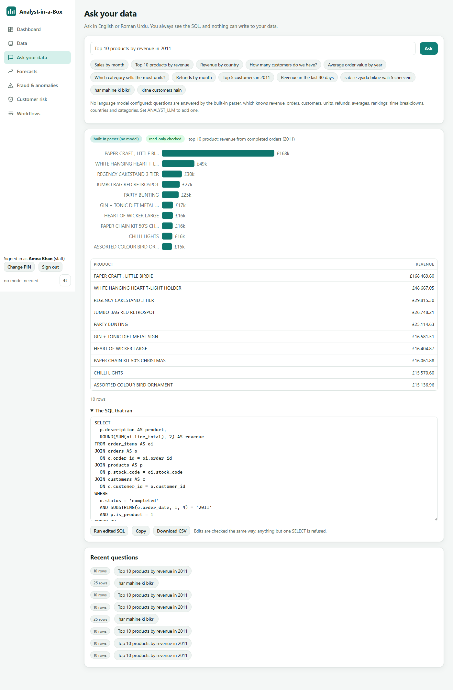 **Ask your data**: result, chart and the SQL that ran | 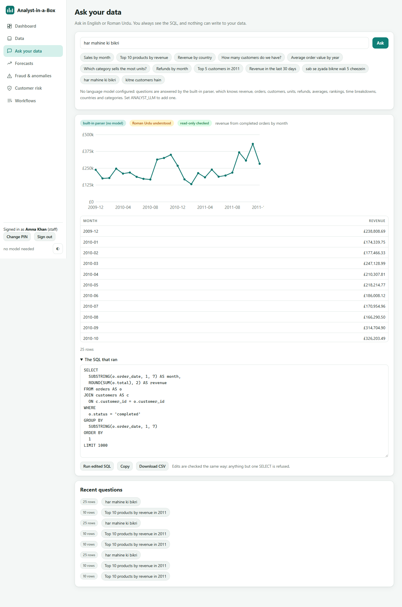 **Roman Urdu**: "har mahine ki bikri" |
| 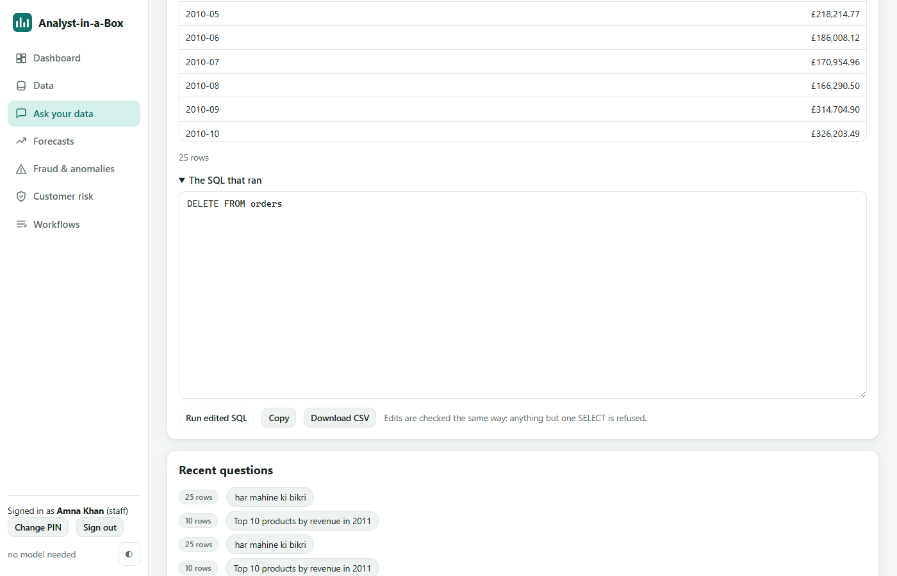 **A write is refused** even when typed into the SQL box | 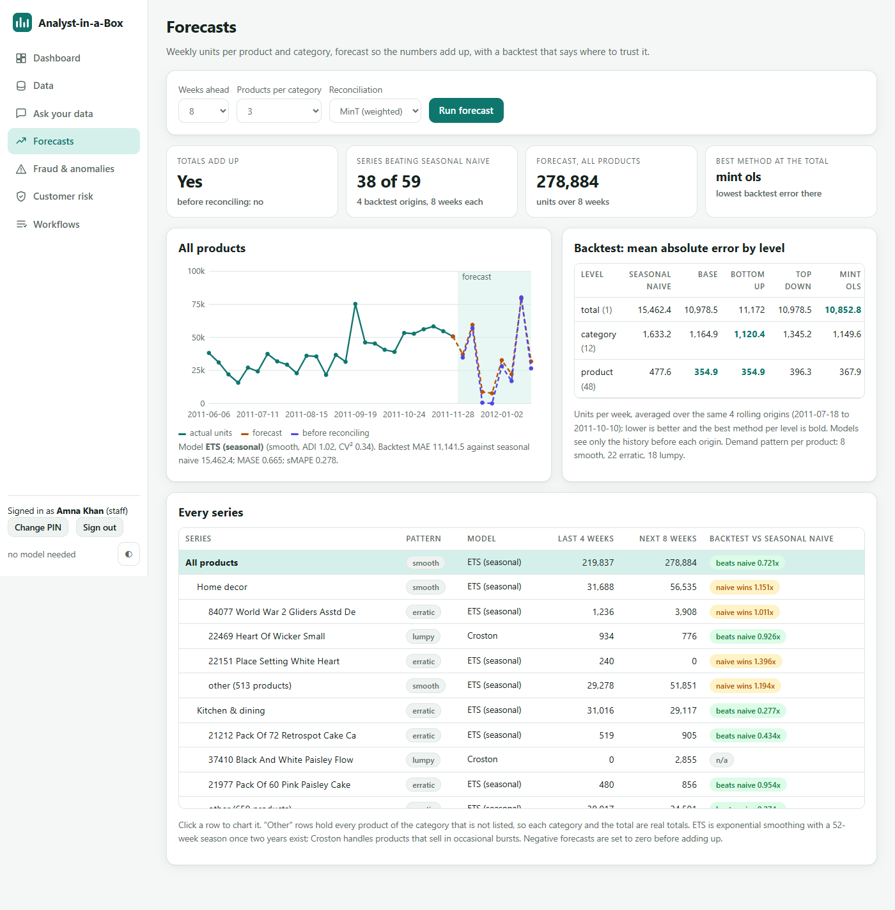 **Forecasts**: coherence, backtest by level, every series |
| 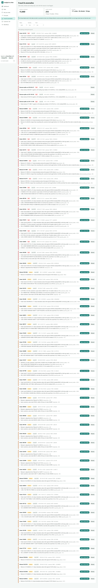 **Fraud and anomalies** with reasons | 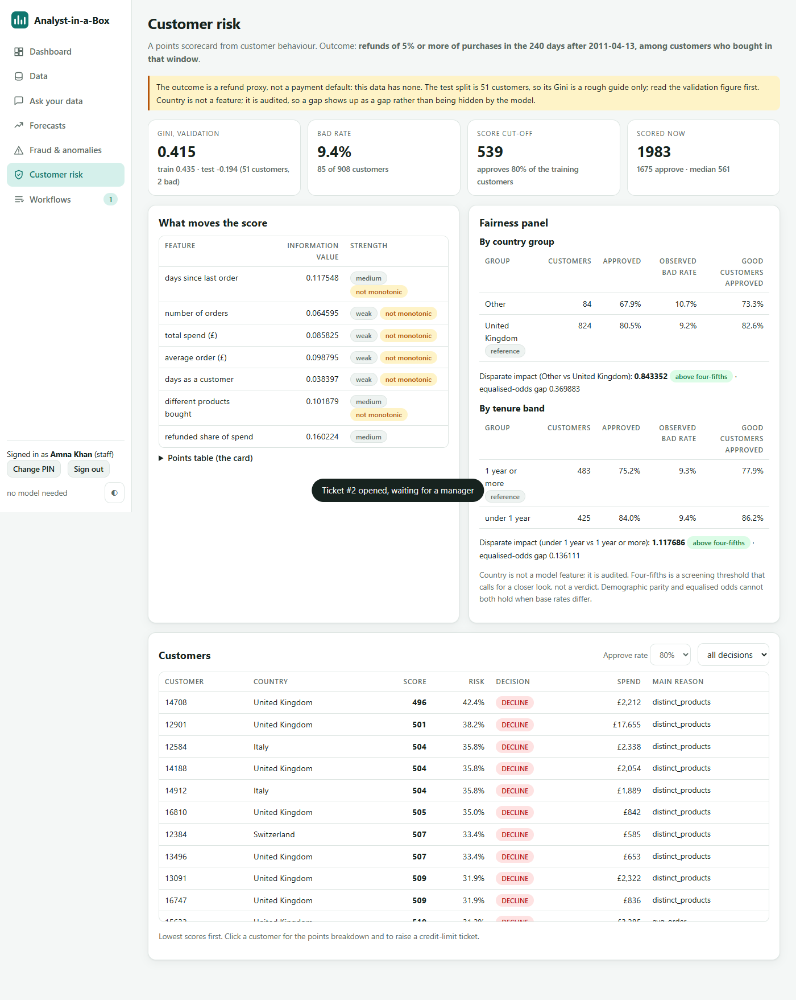 **Customer risk**: scorecard, fairness panel |
| 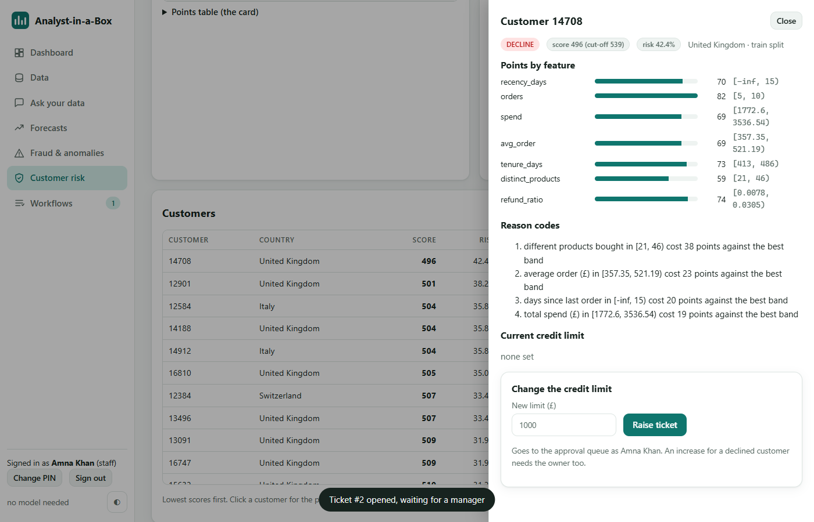 **Customer**: points, reason codes, credit-limit ticket | 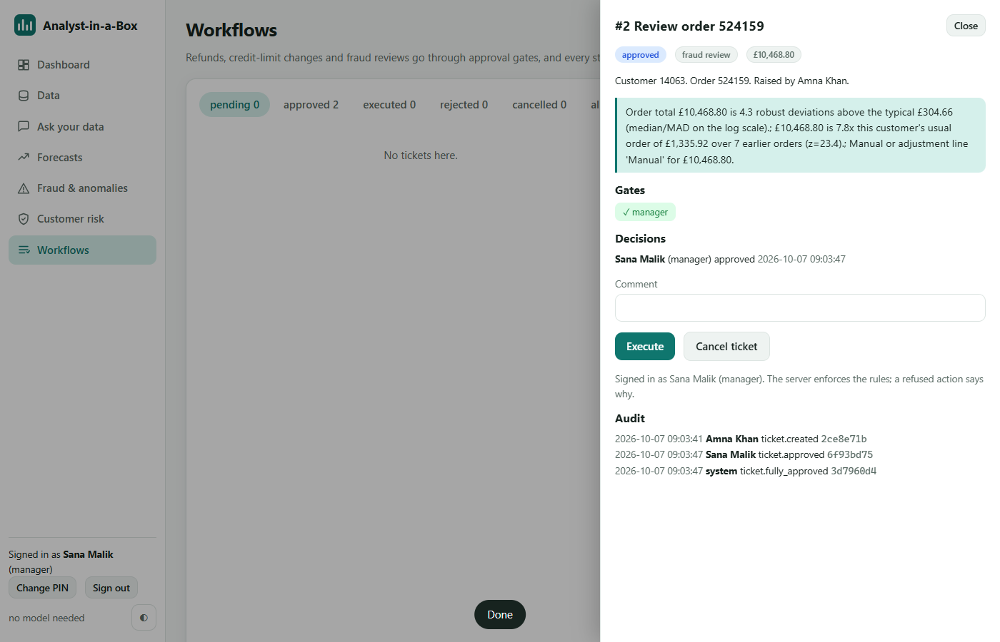 **Workflows**: gates, decisions, audit |
| 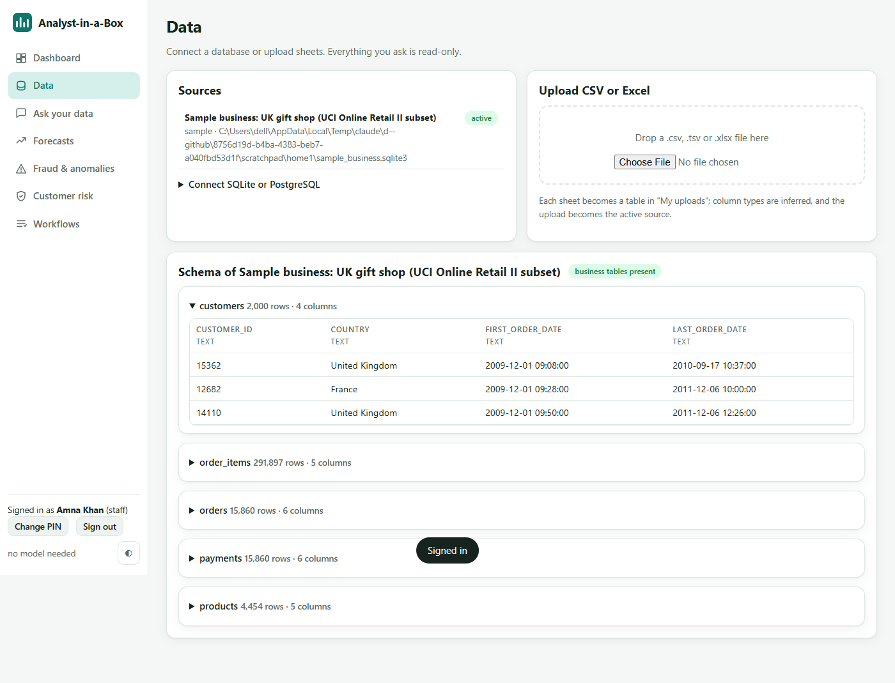 **Data**: sources, upload, schema | 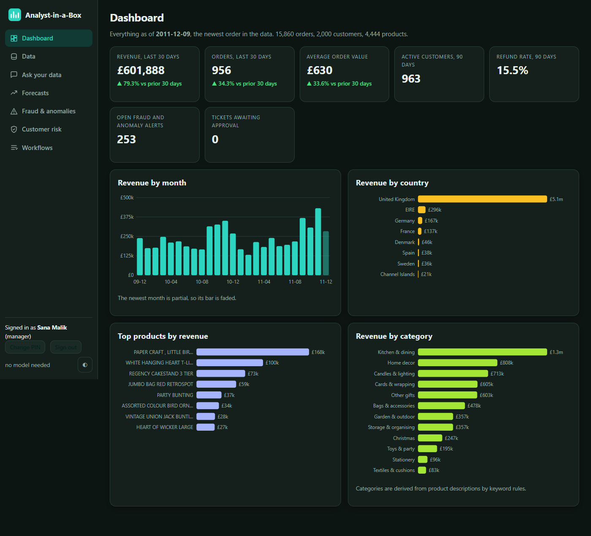 **Dark mode** (phone layout: [13](docs/screenshots/13-mobile-ask.png)) |
| 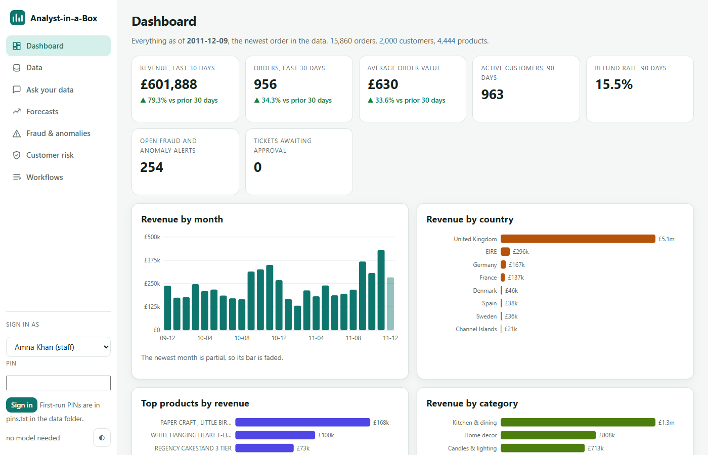 **Sign in** with a name and PIN before acting | 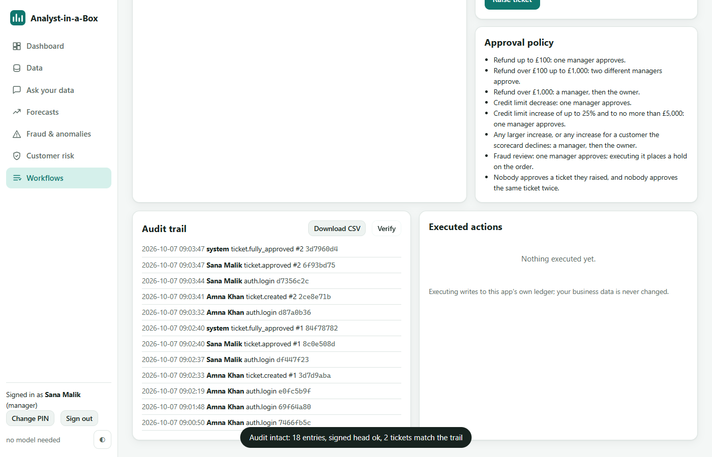 **Audit**: Verify checks the chain, the signed head and every ticket against the trail |

## How it works

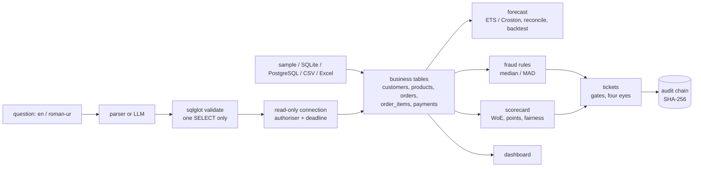

### Read-only by construction

| Layer | Enforced by | Attacked in |
|---|---|---|
| 1. Prompt | tells a model to write one SELECT | never relied on |
| 2. Validator | sqlglot parses the statement: exactly one, a SELECT, no write nodes anywhere (a `DELETE` inside a CTE is caught), no `PRAGMA`/`ATTACH`, no `load_extension`/`readfile`, no `sqlite_*` catalogue (also behind a `main.` prefix), unknown tables rejected, statements over 20,000 characters refused, `LIMIT` injected and clamped | `tests/test_sqlsafe.py`, `tests/test_security.py` |
| 3. Connection | SQLite opened with `mode=ro`, `PRAGMA query_only`, an authoriser that denies everything except reads, a wall-clock deadline, a row cap, and SQLite's own size limits (1 MB per string, expression depth 200, 20 compound selects, no attached databases). Text cells are cut at 5,000 characters, a result at 4 MB, blobs become `<n byte blob>` and NaN/Infinity become null. PostgreSQL runs in a read-only transaction with a statement timeout. | the same tests send writes straight to the runner, skipping layer 2 |

Layers 2 and 3 are independent; the tests break each alone, with 36 hostile statements (stacked statements, comment tricks, Unicode lookalike semicolons, `ATTACH`, `PRAGMA`, `load_extension` in three spellings, CTE writes, `VACUUM INTO`, catalogue reads, a 5,000-deep parenthesis, a 30,000-item `IN` list), a 900 MB `printf` string bomb and a four-way cross join that must time out. The app never writes to your data; the only business-table writes are building the canonical tables from an upload you map.

### What is reused from the other repos

| Repo | How | What for |
|---|---|---|
| `sql-analyst-agent` | validator adapted into `sqlsafe.py` (MIT licence, commit `6ab8f80` noted in the header) | parse-tree SQL validation; extended to SQLite, with a read-only connection layer added |
| `demand-forecast-platform` | path dependency, unmodified | `Hierarchy`, reconciliation (bottom-up, top-down, MinT, blend), ETS, Croston, seasonal naive, MAE, sMAPE |
| `credit-risk-engine` | path dependency, unmodified | WoE/IV binning, logistic fit, points scale, reason codes, calibration, Gini, Brier, fairness audit |
| `incident-copilot` | ideas only | robust z-score with MAD, one-sentence reason per alert |
| `fraudtrail` (private) | ideas only; no code or data copied | which rule families a transaction screen needs |
| `enterprise-ops-crew` | ideas only | ticket state machine with listed legal transitions |
| `visual-analytics` | ideas only | every number read from the artefact that produced it |

The sibling repos belong to other sessions and were only read.

### Forecasts

Weekly units from completed orders, the first and last partial weeks cut (104 full weeks). The hierarchy is total, 12 categories and, in each, the top products by volume plus one "other" leaf for the rest, so every level is a real total. Each series gets a model from its own demand pattern (Syntetos-Boylan ADI and CV²): Croston for intermittent and lumpy demand, ETS otherwise, seasonal once two years of weeks exist. Reconciliation (default MinT weighted) makes the levels add up; negative values are set to zero on the leaves and re-added, so the result is both non-negative and exactly coherent. The backtest uses 4 rolling origins, 8 weeks each, and models see only the history before each origin. The page shows MAE by level for seasonal naive, the unreconciled forecasts and each method, and flags every series where seasonal naive won.

### Fraud and anomalies

Rules and weights (all in `fraud.py`, each alert shows which fired): order total far above the typical order (median/MAD on the log scale, z of 3.5 or more), far above this customer's own earlier orders, an extreme line quantity for the product, a unit price far from the product's median, a manual or adjustment line of £100 or more, a duplicate order (same customer and total within 24 hours), an hour with under 1% of orders, a refund far above typical, a refund larger than everything the customer had bought (only when their first order is inside the data), and daily revenue or order-count spikes against the previous 28 trading days. A score of 20 or more raises an alert; 50 is high, 30 medium. There are no fraud labels in the data, so there is no precision or recall to report, and the UI says an alert is a prompt to look.

### Customer risk

The data has no loan or payment defaults, so "bad" is a proxy: in the 240 days after 2011-04-13 the customer's cancelled orders total at least 5% of what they bought in that window, among customers who bought in it. Features come only from orders before the cut-off (days since last order, orders, spend, average order, tenure, distinct products, refunded share). Customers are split 80/15/5 by a hash of their id. Country is deliberately not a feature; it is audited, together with tenure band, using the four-fifths screen and equalised-odds gaps. The same code takes a real default flag when you have one.

### Approval policy

Refund up to £100: one manager. Over £100 up to £1,000: two different managers. Over £1,000: a manager then the owner. Credit limit decrease: one manager; increase of up to 25% and to no more than £5,000: one manager; anything larger, or any increase for a customer the scorecard declines (decided by the server, not the caller): a manager then the owner. Nobody approves their own ticket or approves twice. A refund cannot exceed what is left of its order, counting refunds already paid and tickets still open, and the order is checked again when the ticket is executed. Executing writes to the app's own ledger and credit-limit table. Who is acting comes from the signed-in session, never from the request body: a request that names someone else is refused with 403. Approvals, executions and the ledger are serialised and backed by unique indexes, so ten simultaneous approvals by one manager count once and a ticket pays once.

### The audit trail

Each entry's SHA-256 covers the previous hash, so editing or deleting a row breaks every hash after it. A chain alone cannot see its own tail cut off or a whole-chain recompute, so the head (count, last id, last hash) is also written, HMAC-signed, to `analyst.sqlite3.audit-head` with the key in `analyst.sqlite3.audit-key`, outside the database. **Verify** reports one of `ok`, `shortened` (tail or whole trail deleted), `rewritten` (chain recomputed), `forged` (head file altered) or `missing`. It then checks every ticket against the trail (status, requester, amount, gates, approvals), every ledger row and every credit limit against an audited execution, which catches `UPDATE tickets SET status='approved'` straight into the file. Each case is a test. Older databases get their head file on the first start if their chain verifies.

## What the checks show

Every number is printed by the code in this repository.

| Check | Result |
|---|---|
| Tests | 152 passing, ruff clean. API tests hit every endpoint; `test_security.py` (82 tests) holds every attack found in the review as a regression test; workflow tests cover gates, roles, four-eyes, illegal transitions and over-refund. |
| Hermetic | Tests build a 700-customer slice of the sample in a temp directory and never touch `~/.analyst-in-a-box`. |
| Forecast | Totals disagree before reconciling and add up after; 38 of 59 series beat seasonal naive on the backtest. At the total, MinT-weighted MAE is 11,141 units a week against 15,462 for seasonal naive. |
| Fraud | 255 alerts on 15,860 orders (24 high, 81 medium, 150 low). A planted £250,000 manual-line order in a copy of the data is flagged high (test). |
| Risk | Gini 0.435 train, 0.415 validation, -0.194 test. |
| UI tour | Every page, a refused write, a Roman Urdu question, a ticket raised from an alert and approved: no unexpected console error. |

## What it does NOT do

- **No fraud verdicts.** No labels exist, so alerts are unmeasured prompts. Large wholesale orders are normal in this data, so many flags are real customers buying a lot.
- **The risk model is a refund-behaviour proxy**, not credit-loss prediction, and it is weak: the held-out test split is 51 customers with 2 bad outcomes, so its Gini (-0.194) says nothing either way. Read the validation Gini (0.415, 128 customers) as modest. Several features are not monotonic, and the UI says so.
- **The fairness panel audits two groupings** (country group and tenure band). It is a screen, not proof of fairness, and a small "Other" country group makes its rates noisy.
- **Forecasts cover units, not revenue**, and only products that sold at least once; the next 8 weeks cross the Christmas gap, which with two years of history is one repeat. The total can beat seasonal naive while individual categories do not.
- **The built-in parser is not a language model.** It composes revenue, orders, customers, units, refunds, averages, rankings, time breakdowns, country, category and date filters; "compare 2010 with 2011" or free-form joins need a model. When it cannot map a question it says so rather than guess. Roman Urdu is a glossary of about 60 business words.
- **PostgreSQL** supports Ask and the schema browser only; the dashboard, forecasts, fraud and risk need the SQLite business tables. It was not tested against a live server in this build.
- **Sign-in is PINs for a fixed list of four people on one machine**, not single sign-on: users cannot be added from the UI, PINs are short, and sessions last 12 hours. Anyone with file access to the data folder can still edit the database, the head file and its key; the audit checks make that detectable only against someone without all three. Locking a name after five failures also lets a stranger lock a person out for a minute.
- **Uploads have limits, not quotas**: 40 MB, 1,000,000 rows, 500 columns, 100,000 characters per cell, 400 MB unpacked for a workbook; the uploads database itself is unbounded.
- **PostgreSQL URLs are connected to as given**, so on a shared network the "add a source" box can probe internal hosts. It needs a manager sign-in and is meant for one trusted machine.
- **No payment data.** Payments and categories are derived (see The data).

## The 2026-10-07 security review

A hostile read of the code, each finding reproduced before it was fixed, each fix pinned by a test in `tests/test_security.py`. Work notes: [docs/REVIEW.md](docs/REVIEW.md).

- **Four-eyes was bypassable by anyone** (high): the acting name came from a drop-down and the request body, so one person could raise a refund as Amna and approve it as Bilal and Sana. Now PIN sign-in and a server-side session.
- **Over-refund** (high): three tickets for the full 426.30 of one order were all approved and executed (1,278.90 paid). Open tickets now count against the order and execute re-checks it.
- **Approval race** (high): eight simultaneous approvals by one manager were all recorded, which could fill both gates of a two-manager refund. State changes are serialised and the database has unique indexes.
- **Audit trail** (medium): deleting the last entries, or recomputing the chain after an edit, verified as intact, and editing the tickets table directly was invisible. Signed head file and a cross-check against the live tables.
- **String bomb** (medium): `printf('%.*c', 900000000, 'x')` built a 900 MB string in 6.6 s and was returned to the browser. SQLite length limit, cell and result caps.
- **CSRF and DNS rebinding** (medium): a cross-origin upload or JSON write with a foreign `Host` was accepted. Origin, Host and Sec-Fetch-Site checks, body-size limits, CSP and the usual headers.
- **Uploads** (medium): a 130 KB cell crashed with a 500; a decompression-bomb workbook was unpacked; an 18-digit id was rounded to the nearest float (123456789012345678 became ...680) and `00123` became 123; `NaN` and an out-of-range integer raised. All are 400s or are stored faithfully now.
- **NaN / Infinity amounts** (medium): `NaN` passed every comparison in the ticket checks. Amounts must be finite and below 1e12.
- **Smaller**: the app's own database could be added as a data source (it holds the PIN hashes); a table name with a quote broke the schema browser; a `main.sqlite_master` reference leaned on a second layer; a page that finished loading after you had moved on painted over the new one.

No bypass of the read-only guarantee was found: every attack above was refused by layer 2 or 3, and the authoriser alone stopped every write.

## Problems hit while building this

- **The first quantity rule fired 1,960 times.** Wholesale lines are 6, 12 or 24 of an item, so a MAD of a few units made almost every large line "extreme". It now needs a robust z of 10, at least 20 times the usual line and at least 100 units, and carries a weight below the alert threshold, so it only matters together with another reason. Alerts went from 2,088 to 153 on the first 800-customer sample.
- **Postage and carriage were flagged as manual adjustments.** `DOT` and `C2` are ordinary lines in this file; only `M`, `ADJUST`, `D`, bank charges, commission and test codes count.
- **The first risk target measured volume.** "Any cancellation in the next 180 days" gave a Gini of 0.73 and IV above 0.5 on orders, spend and recency, because customers who order more cancel more. Restricting to customers who bought in the window and requiring refunds of 5% of what they bought gave the honest, lower numbers above. Even that left too few bad outcomes on 800 customers, which is why the sample is 2,000.
- **A "pick the best of three models" step made the backtest worse** (a noisy 8-week holdout chooses noise), so model choice is by demand pattern only.
- **An invoice number of 0 was dropped.** In an uploaded sheet an integer id column can hold 0, and `str(value or "")` turned it into "no invoice"; found by a test of the column-mapping path.
- **Two regexes carried backspace characters** from an escaping slip in a patch script, silently disabling "how many orders"; the tests caught it.
- **The largest "completed" order is also a data artefact.** The top product by revenue is a 80,995-unit order cancelled minutes later on the same day. Both rows are in the file; revenue counts the completed invoice and refunds count the cancellation.

## Licence

MIT. Sample data: UCI Online Retail II, CC BY 4.0.
